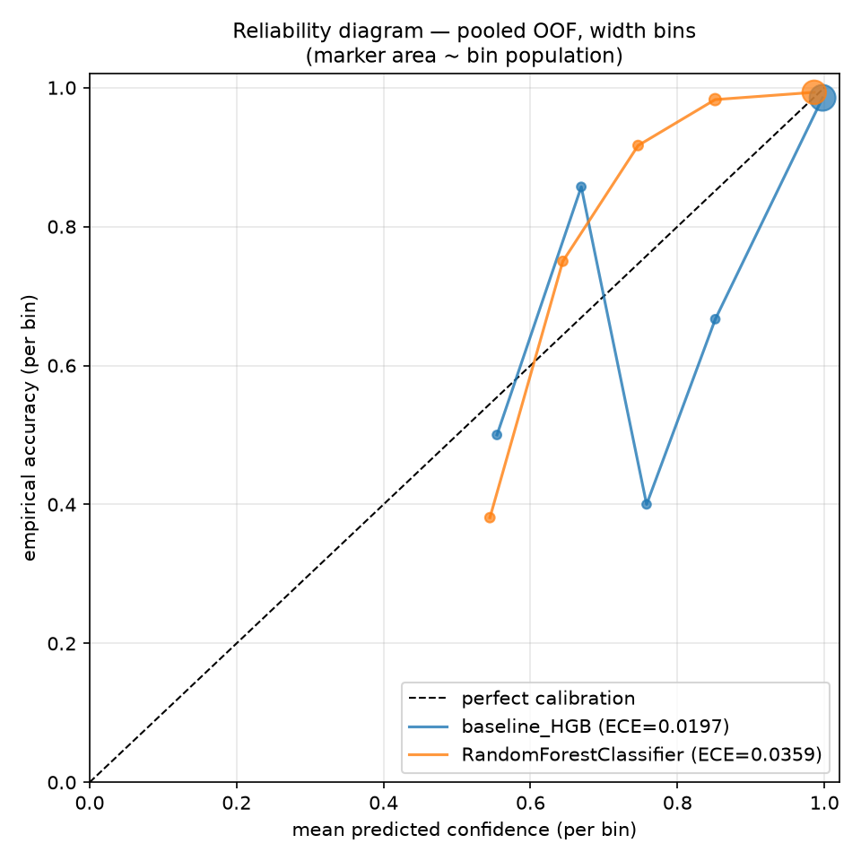

# tabicl-calibration-gate

[](https://github.com/klodynlov/tabicl-calibration-gate/actions/workflows/ci.yml)

A small, reusable **calibration gate** for tabular classifiers — TabICL-first, model-agnostic, 100 % local.

Before you trust a model's probabilities, you should check one thing: **is its confidence calibrated?** A model can be accurate yet pathologically over-confident — its predicted probabilities then mean nothing, and any confidence threshold you set downstream (auto-label above 0.8, escalate below 0.5…) is noise.

This gate computes out-of-fold predictions **once** per model (stratified CV) and derives everything from that single pass:

- accuracy, balanced accuracy, **f1-macro**, f1-weighted, log-loss, **multiclass Brier**, **Expected Calibration Error (ECE)** — all in the main table
- a text **reliability curve** + **classwise-ECE** (`--calibration`, no extra compute), with equal-width or equal-mass bins (`--ece-binning`)
- a saturation flag (only raised when over-confidence comes *with* miscalibration)
- an optional reliability-diagram **PNG** (`--plot`) and a nested **temperature-scaling diagnostic** (`--temperature`)

and **gates** a candidate model against a baseline (`HistGradientBoosting`) on a chosen metric — **including `ece`, `log_loss` and `brier`** — using the **paired per-fold delta**: both models are evaluated on identical folds, so the fold-wise difference is a paired sample, far less noisy than comparing two means. Optional `--max-ece` and `--max-classwise-ece` add absolute calibration ceilings (pooled, and worst-class). Non-zero exit code on regression — so it drops straight into CI.

It uses [TabICL](https://github.com/soda-inria/tabicl) (a SOTA tabular foundation model) as the candidate model when installed — but **any sklearn-compatible classifier** can be the candidate via `--candidate module.path:ClassName`. Without a candidate it runs baseline-only, which is still a valid calibration check. Everything runs offline.

## Why calibration, not just accuracy

Two models can hit the same accuracy while one is honest about its uncertainty and the other isn't:

```
=== calibration: baseline_HGB ===   ECE=0.0197
  [0.90-1.00) n=545  conf=0.998  acc=0.985  gap=-0.012     # mildly over-confident

=== calibration: TabICL ===         ECE=0.0090
  [0.90-1.00) n=525  conf=0.995  acc=0.994  gap=-0.001     # confidence ≈ accuracy
```

Lower ECE = the displayed confidence matches the real accuracy. That makes the confidence a usable decision variable — essential for selective automation, risk scoring, and human-in-the-loop triage.

## Install

```bash
pip install .            # installs the `tabgate` command
pip install ".[tabicl]"  # + the TabICL candidate model (optional)
pip install ".[plot]"    # + matplotlib, for --plot (optional)
```

(Or dependency-only, no install: `pip install numpy "scikit-learn>=1.3" pandas` and run `python calibration_gate.py …` — same CLI.)

Python 3.10+. Feature columns must be numeric (encode categoricals first); the gate fails loud (exit `2`, clear message) otherwise — same for classes rarer than `--folds`, infinite values, and NaN when PCA would apply.

## Usage

```bash
# sklearn-bundled dataset + calibration diagnostics
tabgate --dataset breast_cancer --calibration

# your own data
tabgate --csv data.csv --target label --calibration

# high-dimensional inputs (e.g. embeddings) get auto-PCA before the model
tabgate --csv embeddings.csv --target y --n-pca 64

# Apple Silicon
tabgate --dataset wine --device mps --calibration

# any sklearn-compatible classifier as the candidate (replaces TabICL)
tabgate --dataset breast_cancer \
    --candidate sklearn.ensemble.RandomForestClassifier \
    --candidate-args '{"n_estimators": 200}' --gate-metric ece

# machine-readable report (written for PASS and FAIL alike)
tabgate --csv data.csv --target y --gate-metric ece --max-ece 0.05 --json report.json

# per-class ceiling (downstream uses per-class thresholds) + equal-mass bins
tabgate --csv data.csv --target y --max-classwise-ece 0.08 --ece-binning mass

# is the miscalibration fixable post-hoc? + reliability-diagram PNG
tabgate --dataset breast_cancer --temperature --plot reliability.png
```

Bundled datasets: `breast_cancer`, `wine`, `iris`, `digits`. The gate is multiclass-safe.

### Example output

```
dataset: n=569, features=30, classes=2 | folds=5

              accuracy  bal_acc  f1_macro  f1_weighted  log_loss  brier    ece  wall_s
model
baseline_HGB    0.9701   0.9646    0.9677       0.9700    0.1047 0.0474 0.0288  1.3181
TabICL          0.9824   0.9802    0.9812       0.9824    0.0613 0.0302 0.0197  2.5251

=== calibration: TabICL ===
mean confidence=0.976 | accuracy=0.982 | ECE=0.0090 (pooled)
share conf>0.99 = 82.6%
classwise-ECE mean=0.0177 | worst: 0=0.0177, 1=0.0177
reliability curve (confidence vs accuracy per bin, width bins):
  [0.60-0.70) n=   15  conf=0.645  acc=0.733  gap=+0.088
  [0.80-0.90) n=   17  conf=0.848  acc=1.000  gap=+0.152
  [0.90-1.00) n=  525  conf=0.995  acc=0.994  gap=-0.001

[gate] f1_macro: TabICL=0.9812 vs baseline_HGB=0.9677 (epsilon=0.0)
[gate] paired delta per fold ('+' = candidate better): +0.0135 ± 0.0158 (min +0.0000, 5 folds) -> PASS
[gate] classwise-ECE ceiling: worst class '0' ECE=0.0177 <= 0.1 -> PASS
[gate] overall -> PASS
```

(The table's `ece` column is the per-fold mean — the value the gate compares; the `--calibration` section shows the pooled-OOF ECE alongside the curve. They differ slightly by construction. `brier` is the multiclass Brier score — full probability vector vs one-hot truth, range [0, 2], strictly proper: confident mistakes cost more than hesitant ones.)



### Per-class thresholds? Gate the classwise-ECE

Top-label ECE can look fine while one class is badly miscalibrated. If anything downstream applies a **per-class** confidence threshold (auto-label class *c* above 0.6…), the number that matters is the **classwise-ECE** (Kull et al. 2019): for each class, p<sub>c</sub> against the empirical frequency of *c*, over all samples. `--calibration` prints the per-class values; `--max-classwise-ece` fails the gate on the candidate's **worst** class.

### Is the miscalibration even fixable? (`--temperature`)

Before rejecting a miscalibrated model, ask whether one scalar would fix it. `--temperature` runs a **nested** temperature-scaling diagnostic: per outer fold, T is fitted on inner-CV out-of-fold probabilities of the training part only (leak-free — the test fold never touches the T fit), then applied to the outer test probabilities:

```
=== temperature scaling (nested, diagnostic — never gates) ===
baseline_HGB: T=1.864 (per fold: 1.75, 1.82, 2.04, 1.89, 1.82) | pooled ECE 0.0197 -> 0.0097
TabICL: T=1.115 (per fold: 1.21, 1.08, 1.40, 0.93, 0.96) | pooled ECE 0.0090 -> 0.0101
```

Read: the baseline is over-confident but **fixable post-hoc** (T≈1.9 halves its ECE); TabICL is already calibrated (T≈1, scaling changes nothing). It never affects the verdict, and costs ~(folds−1)× extra predictions.

### Equal-mass bins

When most confidences cluster above 0.99, equal-width bins leave one dominant cell and the ECE rests on it. `--ece-binning mass` switches every ECE (table, gate, curves) to quantile bins with balanced population — same estimator, steadier estimate.

## In CI

Exit codes: **`0`** gate PASS (or baseline-only, no verdict) · **`1`** gate FAIL · **`2`** invalid input (non-numeric features, class rarer than `--folds`, NaN where PCA would apply, infinite values, all-NaN report) — bad data can never turn a CI job green.

```yaml
- run: tabgate --csv data.csv --target label --gate-metric ece --max-ece 0.05 --require-candidate --json report.json
- uses: actions/upload-artifact@v4
  with: { name: calibration-report, path: report.json }
```

> If TabICL is **not** installed, the gate prints baseline-only and exits `0` (no verdict). Pass `--require-candidate` to make that case fail loud (exit `2`) instead — recommended in CI so a broken install can't pass silently. (`--candidate` needs no such guard: a missing plugin class is already exit `2`.)

`--json` writes the full report — per-model metrics, per-fold values, pooled and classwise ECE, the gate verdict with paired deltas, the temperature block when requested, and the exit code — for trend tracking across runs (`schema_version: 2`). This repo's [own workflow](.github/workflows/ci.yml) dogfoods all three exit codes plus the brier/mass-bins/classwise/temperature path on every push.

## Options

| flag | default | meaning |
|------|---------|---------|
| `--dataset` / `--csv` + `--target` | `breast_cancer` | data source (bundled or your CSV) |
| `--n-pca` | `64` | PCA components when `n_features` exceeds it (`0` disables) |
| `--folds` | `5` | stratified CV folds |
| `--gate-metric` | `f1_macro` | metric the PASS/FAIL is decided on: `f1_macro`, `f1_weighted`, `bal_acc`, `accuracy`, `log_loss`, `brier`, `ece` (the last three gate lower-is-better) |
| `--epsilon` | `0.0` | tolerance on the paired mean delta: candidate may be worse by up to epsilon |
| `--max-ece` | off | absolute ceiling on the candidate's pooled ECE (second gate condition) |
| `--max-classwise-ece` | off | ceiling on the candidate's **worst** per-class ECE — the guard for per-class thresholds |
| `--ece-bins` | `10` | number of calibration bins |
| `--ece-binning` | `width` | bin strategy for every ECE: `width` or `mass` (quantile bins, robust to clustered confidences) |
| `--temperature` | off | nested temperature-scaling diagnostic — never affects the verdict |
| `--plot` | off | write a reliability-diagram PNG (needs matplotlib: `pip install ".[plot]"`) |
| `--candidate` | TabICL | import path of a plugin candidate (`module.path:ClassName`, sklearn-compatible, must have `predict_proba`) |
| `--candidate-args` | `{}` | constructor kwargs for `--candidate`, as a JSON object |
| `--json` | off | write a machine-readable JSON report (PASS and FAIL alike) |
| `--require-candidate` | off | exit `2` when `tabicl` is missing instead of green baseline-only |
| `--calibration` | off | print reliability curves + classwise-ECE (ECE is always computed and gateable) |
| `--n-estimators` | `8` | TabICL ensemble size |
| `--device` | auto | TabICL device (`mps`, `cpu`) |
| `--random-state` | `42` | seed for reproducibility |

## Tests

```bash
python -m pytest test_calibration_gate.py -q   # no tabicl needed (baseline-only path is forced)
```

37 tests. Covers: ECE properties (perfectly calibrated → 0, over-confident → known value, bin weighting), Brier known values, equal-mass bin edges (balanced population, tie collapse) and a hand-computed equal-mass ECE, classwise-ECE known values and its gate ceiling, temperature recovery (a model sharpened by 2× yields T≈2; a calibrated one yields T≈1) and argmax invariance, gate direction for lower-is-better metrics, epsilon tolerance, `--max-ece` ceiling, the `--candidate` plugin path (verdict, bad import, missing `predict_proba`, bad JSON args), the `--json` v2 schema, `--plot` (missing matplotlib → exit `2`; PNG written otherwise), and end-to-end exit codes (`0`/`1`/`2`) on the edge cases above. The GitHub Actions workflow additionally installs the package and exercises all three exit codes through the `tabgate` entry point.

## Background

Built while testing whether a local tabular foundation model is genuinely usable for data that can't leave the machine. Write-up: <https://karaibart.fr/tabicl.html>.

Credit to [soda-inria/tabicl](https://github.com/soda-inria/tabicl) for the model.

## License

MIT — see [LICENSE](LICENSE).
